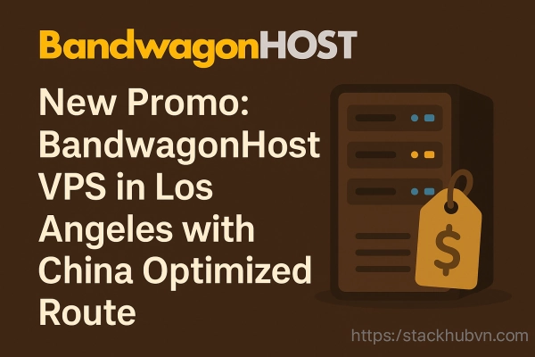

# 搬瓦工洛杉矶机房促销：直连中国的高性价比VPS方案

---

如果你在寻找一台连接中国大陆速度快、价格不贵、还能随时取消的VPS，那这篇文章可能正好帮到你。搬瓦工（BandwagonHost）最近上线了几款针对亚洲用户优化的VPS套餐，主打洛杉矶机房和香港机房，重点是都接入了中国电信和联通的直连线路。对于需要在国内访问速度快、延迟低的场景来说，这个配置算是比较实在的选择。

---

## 洛杉矶促销套餐：专为中国用户优化的直连线路

这次促销的VPS全部部署在洛杉矶机房，走的是中国电信和中国联通的直连线路。什么意思？就是你的数据包不用绕一大圈，直接从洛杉矶到国内，延迟低、丢包少。对于做网站、跑应用、或者需要稳定连接的开发者来说，这种线路质量确实比普通国际线路靠谱多了。

**基础配置亮点：**

- **虚拟化技术**：KVM（通过KiwiVM控制面板管理）
- **操作系统**：支持32位和64位的CentOS、Debian、Ubuntu、Fedora，控制面板秒重装
- **IP地址**：每台机器配1个独立IPv4
- **Root权限**：完全掌控，想装什么装什么
- **网络协议**：支持PPP、TUN/TAP，可以自己搭VPN
- **反向DNS**：控制面板直接配置，不用等工单
- **合约限制**：没有合约，随时可以取消
- **管理方式**：自管理（没有技术支持，适合动手能力强的用户）
- **在线率保证**：99%
- **退款政策**：30天无理由退款
- **机房位置**：美国洛杉矶（本次促销专属）
- **中国连接**：中国电信和联通直连

**20G KVM 促销套餐**

- **硬盘**：20 GB SSD（RAID-10阵列）
- **内存**：1 GB
- **CPU**：2核 Intel Xeon
- **流量**：1 TB/月
- **端口速度**：1 Gbps
- **虚拟化**：KVM
- **价格**：$49.99/年

如果你只是搭个小网站、测试环境或者轻量应用，👉 [这个年付不到50美元的方案性价比相当高](https://bandwagonhost.com/aff.php?aff=79616)，流量够用、速度也在线。

**40G KVM 促销套餐**

- **硬盘**：40 GB SSD（RAID-10阵列）
- **内存**：2 GB
- **CPU**：3核 Intel Xeon
- **流量**：2 TB/月
- **端口速度**：1 Gbps
- **虚拟化**：KVM
- **价格选项**：
  - 半年付：$52.99
  - 年付：$99.99

这个配置适合跑中型项目或者多个服务，内存翻倍、流量也更充裕，年付不到100刀算是很实惠了。

---

## 香港VPS：更低延迟的高端选择

除了洛杉矶，搬瓦工还提供香港MCX10机房的VPS套餐。香港到国内的延迟通常比美国低一半以上，如果你的应用对延迟特别敏感（比如游戏服务器、实时API、金融交易类应用），香港机房会是更好的选择。同样接入了中国电信和联通的直连线路，走的是优化路由。

**香港套餐特点：**

- **机房位置**：香港MCX10数据中心
- **中国优化路由**：中国电信和联通直连
- **虚拟化**：KVM（KiwiVM面板管理）
- **操作系统**：32位和64位CentOS、Debian、Ubuntu
- **IPv4**：1个独立IP
- **IPv6**：不支持
- **Root权限**：完全控制，秒级重装系统
- **反向DNS**：面板即时配置
- **在线率保证**：99.9%
- **支持等级**：仅自管理（无技术支持）
- **合约条款**：无合约，随时取消

香港的套餐价格通常比洛杉矶高一些，但如果你的用户主要在国内，多花点钱换来更低的延迟和更好的用户体验，往往是值得的。👉 [特别是对于需要实时响应的业务场景，搬瓦工的香港直连线路表现相当稳定](https://bandwagonhost.com/aff.php?aff=79616)。

---

## 这些套餐适合谁？

说实话，这些VPS不是给所有人准备的。如果你是技术小白，需要客服手把手教你配置服务器，那可能要失望了——搬瓦工这些促销套餐都是"自管理"模式，没有技术支持。但如果你：

- 懂基本的Linux命令
- 需要一台连接中国速度快的服务器
- 预算有限但不想妥协线路质量
- 想自己控制服务器的每个细节

那这些套餐就很合适。洛杉矶的适合预算紧张、对延迟要求不是特别极端的场景；香港的适合追求极致速度、预算稍微宽裕一点的用户。

另外提醒一句：这些套餐都有30天退款政策。如果买了发现不合适，可以直接申请退款，不用担心踩坑。

---

搬瓦工这次的促销套餐，核心卖点就是"中国直连线路+自管理灵活性+合理价格"。如果你正好需要一台连接中国速度快、配置够用、价格不虚高的VPS，可以试试看。毕竟年付50美元起的价格，试错成本也不高。搬瓦工的稳定性和线路质量在业内口碑一直不错，[对于需要中国优化线路的用户来说，确实是个值得考虑的选择](https://bandwagonhost.com/aff.php?aff=79616)。
